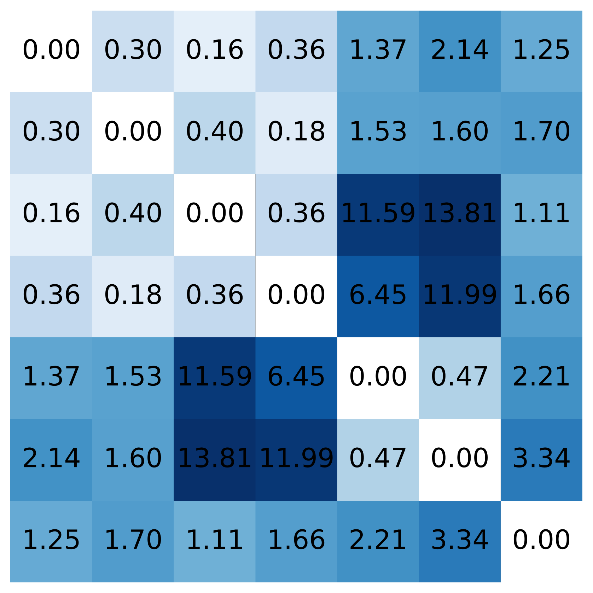
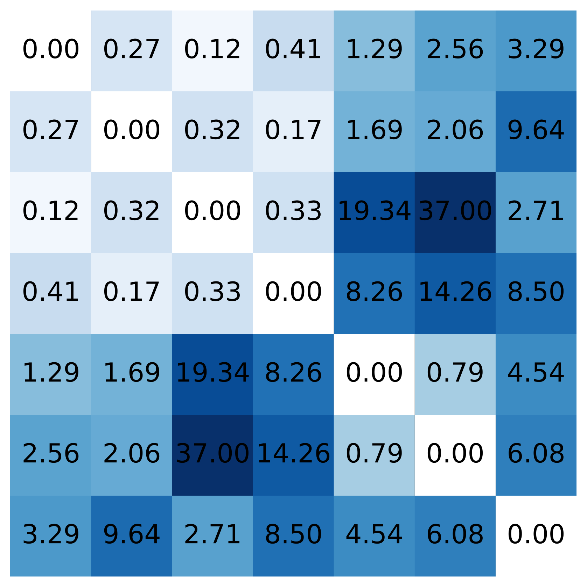
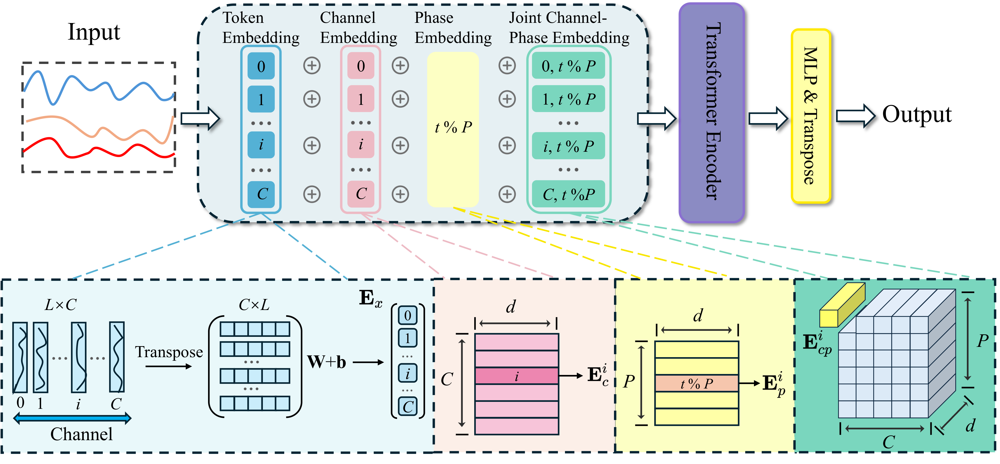
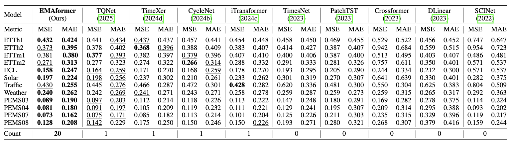
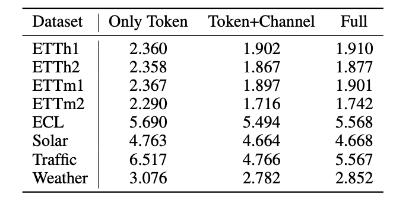
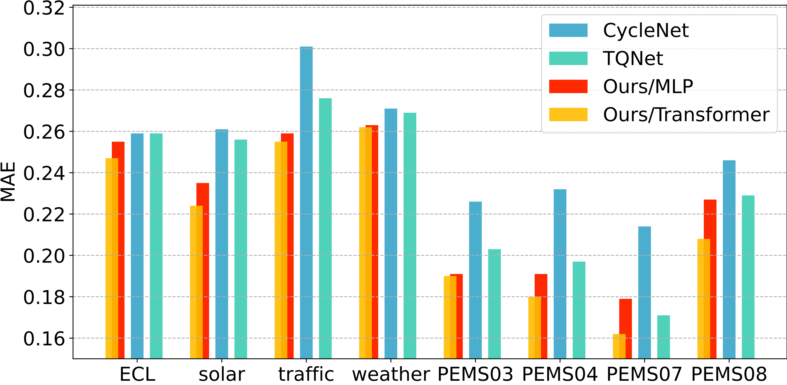

<h1 align="center">
  <br>
  EMAformer
</h1>

<p align="center">
  <em>Equip your Transformer with embedding armor and beat the MLPs in time series forecasting.</em>
</p>

<p align="center">
  
  
  <a href="https://arxiv.org/abs/2511.08396">
    
  </a>
</p>

This is the official implementation of the paper, [EMAformer: Enhancing Transformer through Embedding Armor for Time Series Forecasting](https://arxiv.org/abs/2511.08396), accepted by AAAI 2026.

If you are wondering why explicitly modeling inter-channel dependencies might lead to a decline in predictive performance and want to use Transformers for time series analysis, this repository is well-suited to you.

## Updates

- 🌟 (2025.11) EMAformer was accepted by AAAI 2026.

## Introduction

EMAformer enhances the Transformer architecture by simply introducing additional embeddings. It achieves state-of-the-art performance on 12 real-world benchmarks, reducing forecasting errors by an average of 2.73% in MSE and 5.15% in MAE.

<p align="center">
  
  
</p>

We analyzed inter-channel correlations using the coefficient of variation (CoV), which measures relative fluctuation around the mean of inter-channel
correlations. For example, on ETTh2 and ETTm2, these correlations swing wildly over time, yielding the extremely high CoV values. Such volatility implies that local inter-channel relationships are inherently unstable. Such fluctuations can mislead self-attention mechanisms, resulting in suboptimal performance.

<p align="center">

</p>

Overview of EMAformer. We enhance a Transformer within variate tokenization framework by integrating three types of auxiliary embeddings: (1) channel embeddings to capture the global representation and stabilize local inter-channel relations; (2) phase embeddings to restore the temporal detail and enhance phase sensitivity; and (3) joint channel-phase embeddings to capture intricate dependencies across channel and temporal dimensions.

<p align="center">

</p>

Performance comparison of multivariate long-term time series forecasting. Our model achieves the best results in 20 cases and the second-best in 3 cases. Experiments are conducted with a fixed historical window length $L = 96$, and results are averaged over prediction horizons $H \in$ {12, 24, 48, 96} for PEMS series or {96, 192, 336, 720} for the rest of datasets. The best outcomes are highlighted in **bold**, while the second-best are underlined. Lower values indicate better performance.

<p align="center">

</p>

Entropy of the attention score. According to entropy changes, it turns out that our embedding scheme preserves periodicity while enabling the channel to focus more on information that is truly beneficial for prediction.

<p align="center">

</p>

Comparison of our embedding strategy by replacing the Transformer backbone with MLP, against the strongest existing MLP baselines. Our MLP variant outperforms other MLP baselines across almost all datasets, underscoring the effectiveness of our embedding design.

## Environment

- Python 3.8
- PyTorch >= 2.0.0 + CUDA >= 12.0
- Dependencies pinned in `requirements.txt`

```bash
git clone https://github.com/PlanckChang/EMAformer.git
cd EMAformer
conda create python=3.8 -n EMAformer
conda activate EMAformer
pip install -r requirements.txt # -i https://pypi.tuna.tsinghua.edu.cn/simple
```

## Repository Layout

- `run.py` — unified entry point for training and evaluation.
- `model/` — EMAformer and baselines
- `layers/` — attention, embedding, and encoder components.
- `data_provider/` — dataset loaders and factory utilities.
- `experiments/` — experiment engine.
- `scripts/` — ready-to-run bash scripts for each setting.
- `utils/` — metrics, time feature engineering, helper tools.

## Data Preparation

1. The datasets can be obtained from [Google Drive](https://drive.google.com/file/d/1l51QsKvQPcqILT3DwfjCgx8Dsg2rpjot/view?usp=drive_link) or [Baidu Cloud](https://pan.baidu.com/s/11AWXg1Z6UwjHzmto4hesAA?pwd=9qjr).
2. Organize them under a root directory and `unzip` it into the directory `dataset`.

## Quick Start

Run the scripts.

```bash
# run the multivariate forecasting experiments with ECL  
bash scripts/multivariate_forecasting/ECL/EMAformer.sh
```

Key CLI arguments:

- `--seq_len`, `--pred_len`: input steps and output steps.
- `--d_model`, `--n_heads`, `--e_layers`, `--d_ff`: backbone width/depth.
- `--cycle`: length of predefined periodicity.
- `--enc_in`, `--dec_in`, `--c_out`: the number of channels and all are the same in EMAformer.

## Extending EMAformer

- Implement a new dataset by adding a loader in `data_provider/data_loader.py` and registering it in `data_provider/data_factory.py`.
- Add new models by creating a module under `model/` and listing it in `experiments/exp_basic.py`.

## Citation

If you find this repo useful, please cite our paper.

```
@inproceedings{emaformer2026,
  title     = {EMAformer: Enhancing Transformer through Embedding Armor for Time Series Forecasting},
  author={Zhiwei Zhang and Xinyi Du and Xuanchi Guo and Weihao Wang and Wenjuan Han},
  booktitle={The Fortieth AAAI Conference on Artificial Intelligence},
  year      = {2026}
}
```

## License

This project is licensed under the MIT license. See `LICENSE` for details.

## Contact & Support

For questions, please open an issue or contact the authors. Contributions, bug reports, and improvement suggestions are welcome.

- Zhiwei Zhang <zhiweizhang@bjtu.edu.cn>

## Acknowledgement

We appreciate the following GitHub repos a lot for their valuable code and efforts.

- iTransformer (https://github.com/thuml/iTransformer)
- Time-Series-Library (https://github.com/thuml/Time-Series-Library)
- CycleNet (https://github.com/ACAT-SCUT/CycleNet)
- Genimi (https://gemini.google.com/) offers the EMAformer Logo.
